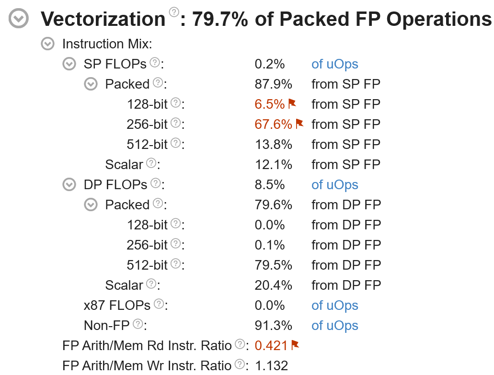

# mpv-winbuild

[](https://github.com/zhongfly/mpv-winbuild/actions)
[](https://github.com/zhongfly/mpv-winbuild/releases/latest)
[](https://github.com/zhongfly/mpv-winbuild/releases)

Use Github Action to build apps for Windows with latest commit.

- mpv
  - PGOed for some use cases
  - with libsixel (PGOed)
  - with win32-subsystem=console (24H2 consoleAllocationPolicy) to get rid of mpv.com wrapper to improve vo=sixel user experience
  - with more complete debuginfo for all deps for profiling and debugging
  - with rubberband
    - use [SLEEF](https://github.com/shibatch/sleef) DFT as FFT library
    - up to 200% faster performance
- mpv-menu-plugin
- mpv-debug-plugin
- ffmpeg
  - PGOed for some codecs
  - with frei0r
  - with whisper
  - patches from [dyphire/mpv-winbuild](https://github.com/dyphire/mpv-winbuild) has been merged to improve user experience
  - patched to use winstore as fallback cert store by default, so TLS verify works out of the box
    - see my [fork](https://github.com/Andarwinux/FFmpeg)
  - patched to enable cuda on aarch64, but availability is not verified
    - NVIDIA may have some Windows Arm products soon
  - all external video codecs libraries have been configured to use win32threads instead of winpthreads
    - see [toolchain.cmake.in](https://github.com/Andarwinux/mpv-winbuild-cmake/blob/master/toolchain.cmake.in#L13-L18)
    - removed all inline and external mmx/sse shit asm
    - added runtime dispatch staticization of external AVX asm to allow compiler to do DCE
    - replace ff_reverse with builtin_elementwise_bitreverse to take advantage of native bitreverse instructions (x86 vgf2p8affineqb/arm64 rbit)
    - added avx512vnni adler32 implementation from zlib-ng
    - added avx512vpclmulqdq crc32 implementation that was intentionally missed by upstream ffmpeg
    - sha1/256/512/md5 has been forwarded to openssl to take advantage of its high performance hash implementation
- mujs
  - PGOed
- curl
  - PGOed
  - patched to use native ca by default
  - with ngtcp2+nghttp3+openssl http3 support
  - with unity build enabled
- aria2
  - PGOed
  - patched to unlock concurrent connection limit
- qBittorrent-Enhanced-Edition
  - PGOed for UI(qtbase) and Network(libtorrent, openssl, boost)
  - with freetype, vulkan
  - patched to enable dpiAwareness by default
  - with QT_FEATURE_winsdkicu enabled, need Windows 10 1903 or higher
- svtav1-psy
  - PGOed
- mediainfo

> [!NOTE]
> The x86-64-v4 build is migrated to [AndarwinuxT/mpv-winbuild](https://github.com/AndarwinuxT/mpv-winbuild). Only x86-64-v3 and aarch64 builds are available here.

> [!NOTE]
>
> My build has more stuff than zhongfly's, but also removed some stuff that seems to be dead, if you find any use cases that make sense for you, or find some funky new features missing, please let me know. (But I always try to avoid any rust stuff if possible)
>
> If you experience lag when using Vulkan, copy the vulkan-1.dll in the package next to mpv.exe and ffmpeg.exe. This may be caused by AVX/SSE transition penalties.
>
> My build removed pthread/winpthreads completely, so it's smaller, faster, and even more reliable, since winpthreads seems to have [handle leaks](https://libera.catirclogs.org/ffmpeg-devel/2025-09-17).
>
> I removed all shit inline/MMX/SSE(1) asm from ffmpeg because that overrides clang’s faster auto-vectorized code, which limits performance.
>
> I also added runtime dispatch staticalization to AVX asm to eliminate extra branches in the runtime dispatch when building ffmpeg with -mavx, -mavx2, -mavx512f and to allow clang to do more aggressive DCE.
>
> All EXEs and DLLs have been hardened with well known runtime mitigations supported by LLVM and Windows and carefully tuned and PGOed to ensure they do not impact performance in any way. Mitigations provided by MinGW CRT are not included currently, as they are unreliable and severely impact performance.
>
> One performance bottleneck for mpv is math functions. MinGW used to always use the x87 FPU to implement them, which was too slow. Later, with UCRT, MinGW would use UCRT SSE2 math functions whenever possible, which was a leap forward, but still not fast enough. My builds incorporate a number of improvements to improve math performance.
>
> All EXEs and DLLs are built with -fveclib=SLEEF to vectorize math functions, which avoids calling MinGW/UCRT's slow scalar impl. Thanks to [SLEEF](https://github.com/shibatch/sleef)'s ultra-high-performance AVX2/AVX512/NEON/SVE2 vectorized impl, the performance of many audio filters like rubberband has been significantly improved.
>
> Due to the extremely poor implementation of fpclassify in MinGW, which causes compilers to generate shit, this problem is addressed by using a modified math.h to redirect fpclassify to builtin_fpclassify, significantly improved the performance of functions like isnan.
>
> x86-64 version uses MSVC-compatible 64-bit long double ABI instead of UNIX/MinGW 80-bit long double ABI, so any FP operations are lowered to AVX instead of x87 FPU (software emulated) to improve performance.
>
> x86-64 version is PGOed to improve performance.
>
> The x86-64-v4 build uses tigerlake as the ISA baseline, but use 512bit vectorwidth.
>
> However, due to AVX512 downclocking, performance regression is expected on icelake/rocketlake.
>
> Because UCRT memcpy only has an incomplete AVX2-optimized implementation, the x86-64-v4 build uses FSRM to inline memcpy directly into rep movsb, significantly improving memcpy performance. This requires icelake/znver3. Due to consideration of older generations like skylake, the x86-64-v3 build does not have this optimization.
>
> To further address performance issues with memcpy and other string functions, ultra-high-performance routines from llvm-libc have been imported to replace UCRT. Functions such as memcpy, memset, and strlen now benefit from universal AVX2/AVX512/NEON/SVE implementations, delivering strong performance even when FSRM is unavailable.
>
> Only recommended to znver4/5/tigerlake or modern xeon users to try v4 builds. While it may run on icelake/rocketlake, it will only be slower. skylake-avx512 is unsupported because it makes absolutely no sense.
>
> The x86-64-v3 build uses skylake as the ISA baseline.
>
> x86-64-v3 and v4 build applied compiler mitigation (`-mno-gather`) to avoid the performance penalty of the DownFall microcode mitigation.
>
> All asm have been built with SSE2AVX to avoid AVX/SSE transition penalties, and vzeroupper that are no longer needed have been removed to further improve performance.
>
> Eliminated the use of chkstk_ms by increased SizeOfStackCommit to the same 1MB as SizeOfStackReserve. Unlike MSVC's chkstk_ms, compiler-rt's chkstk_ms always perform probing unconditionally rather than only when it is necessary, hence performance issues.
>
> All EXEs are integrated with mimalloc.
>
> mimalloc is configured with MIMALLOC_ARENA_EAGER_COMMIT=1 MIMALLOC_ALLOW_LARGE_OS_PAGES=1 by default. If you encounter lag issues with mpv, set these to 0.
>
> libmpv can't use mimalloc, the only alternative is system-wide Segment Heap:
> ```
> reg add “HKLM\SYSTEM\CurrentControlSet\Control\Session Manager\Segment Heap” /v Enabled /t REG_DWORD /d 1 /f
> ```
> The mpv.exe is built with consoleAllocationPolicy, so make sure you are using Windows 11 24H2 or higher otherwise you will see a console when starting mpv.
> Alternatively, you can use mpv-legacy.exe
>
> The profdata used by PGO is generated manually, so it usually only scrolls every few weeks, during which time there might be random performance regressions.
>
> Since profdata's symbol matching does not support source path relocation, PGO in Action builds is less effective than in local builds. Future improvements to the build method for some performance-critical dependencies may mitigate this issue, but it cannot be fundamentally fixed.
>
> If LargePages support is enabled on your system, mimalloc will automatically use it, and you can also enable LargePages for exe:
> ```
> reg add “HKLM\SOFTWARE\Microsoft\Windows NT\CurrentVersion\Image File Execution Options\mpv.exe” /v UseLargePages /t REG_DWORD /d 1 /f
> ```
> You can use [VMMap](https://learn.microsoft.com/en-us/sysinternals/downloads/vmmap) to check if LargePages works or is a placebo.
>
> Private Data Locked WS are LargePages explicitly allocated by mimalloc via VirtualAlloc API.
>
> Image Locked WS are LargePages coalesced by NT kernel for exe.

Based on <https://github.com/Andarwinux/mpv-winbuild-cmake>.

> [!NOTE]
>
> You can use bin-cpuflags-x86 and VTune to analyze whether automatic vectorization has a positive impact on your use case.
bin-cpuflags-x86 can statically analyze which instructions an executable uses, while VTune can dynamically detect which instructions a program uses and where performance bottlenecks occur.
> 
<details>

<summary>

bin-cpuflags-x86

</summary>

Instructions
------------
= 20917500

X64 9664891 (46.20%)
*    mov     3262706 (15.60%)
*    lea     912837 (4.36%)
*    jmp     632274 (3.02%)
*    je      613316 (2.93%)
*    call    586744 (2.81%)
*    add     523285 (2.50%)
*    cmp     495641 (2.37%)
*    jne     494336 (2.36%)
*    test    271082 (1.30%)
*    pop     263342 (1.26%)
*    push    243973 (1.17%)
*    sub     159963 (0.76%)
*    movsxd  149399 (0.71%)
*    jae     98203 (0.47%)
*    jb      97204 (0.46%)
*    inc     91226 (0.44%)
*    ja      75721 (0.36%)
*    imul    72712 (0.35%)
*    ret     62939 (0.30%)
*    shl     60106 (0.29%)
*    jle     55337 (0.26%)
*    shr     48716 (0.23%)
*    js      42813 (0.20%)
*    jl      37068 (0.18%)
*    jbe     36964 (0.18%)
*    and     35026 (0.17%)
*    jg      30769 (0.15%)
*    dec     27499 (0.13%)
*    jge     25634 (0.12%)
*    or      23861 (0.11%)
*    jns     23567 (0.11%)
*    sar     20960 (0.10%)
*    neg     13900 (0.07%)
*    xor     13022 (0.06%)
*    cdqe    9384 (0.04%)
*    div     8653 (0.04%)
*    adc     8110 (0.04%)
*    movsx   7243 (0.03%)
*    bt      6415 (0.03%)
*    idiv    4126 (0.02%)
*    cqo     4008 (0.02%)
*    not     2995 (0.01%)
*    jp      1840 (0.01%)
*    jnp     1820 (0.01%)
*    jo      1572 (0.01%)
*    shld    1304 (0.01%)
*    sbb     1211 (0.01%)
*    mul     1095 (0.01%)
*    cmpxchg 541 (0.00%)
*    ror     477 (0.00%)
*    shrd    467 (0.00%)
*    xchg    441 (0.00%)
*    bswap   246 (0.00%)
*    bts     220 (0.00%)
*    jno     201 (0.00%)
*    rol     125 (0.00%)
*    movzx   62 (0.00%)
*    movsq   46 (0.00%)
*    pushfq  38 (0.00%)
*    bsr     25 (0.00%)
*    popfq   23 (0.00%)
*    xadd    22 (0.00%)
*    btr     15 (0.00%)
*    bsf     14 (0.00%)
*    btc     5 (0.00%)
*    jrcxz   1 (0.00%)
*   stosq   1 (0.00%)

INTEL386 4546196 (21.73%)
*    mov   1693461 (8.10%)
*    cmp   467864 (2.24%)
*    movzx 427269 (2.04%)
*    xor   413380 (1.98%)
*    add   214178 (1.02%)
*    lea   190085 (0.91%)
*    test  175515 (0.84%)
*    and   139038 (0.66%)
*    sub   113994 (0.54%)
*    imul  103149 (0.49%)
*    shr   100643 (0.48%)
*    shl   58673 (0.28%)
*    movsx 52991 (0.25%)
*    or    50706 (0.24%)
*    inc   48053 (0.23%)
*    sar   44546 (0.21%)
*    setb  43276 (0.21%)
*    dec   29839 (0.14%)
*    sete  25561 (0.12%)
*    setne 23745 (0.11%)
*    neg   23582 (0.11%)
*    idiv  16706 (0.08%)
*    cdq   13409 (0.06%)
*    not   8469 (0.04%)
*    div   7884 (0.04%)
*    setl  7775 (0.04%)
*    setae 7604 (0.04%)
*    setg  5478 (0.03%)
*    setge 4720 (0.02%)
*    setbe 4560 (0.02%)
*    setns 4520 (0.02%)
*    seta  4245 (0.02%)
*    bt    3880 (0.02%)
*    setle 3708 (0.02%)
*    sets  2738 (0.01%)
*    sbb   2033 (0.01%)
*    seto  1973 (0.01%)
*    adc   1846 (0.01%)
*    ror   959 (0.00%)
*    shrd  743 (0.00%)
*    bsr   710 (0.00%)
*    xchg  593 (0.00%)
*    rol   588 (0.00%)
*    cwde  509 (0.00%)
*    shld  390 (0.00%)
*    mul   195 (0.00%)
*    setp  147 (0.00%)
*    bts   108 (0.00%)
*    setnp 51 (0.00%)
*    setno 35 (0.00%)
*    btc   31 (0.00%)
*    btr   20 (0.00%)
*    insd  12 (0.00%)
*    outsd 9 (0.00%)

INTEL8086 1873660 (8.96%)
*    int3  988569 (4.73%)
*    mov   343641 (1.64%)
*    test  188757 (0.90%)
*    cmp   165058 (0.79%)
*    and   56185 (0.27%)
*    or    37087 (0.18%)
*    nop   19645 (0.09%)
*    add   19224 (0.09%)
*    movsb 18036 (0.09%)
*    sub   13477 (0.06%)
*    neg   8021 (0.04%)
*    xor   4072 (0.02%)
*    inc   2722 (0.01%)
*    not   2673 (0.01%)
*    dec   1631 (0.01%)
*    div   1566 (0.01%)
*    adc   834 (0.00%)
*    shr   696 (0.00%)
*    stosb 626 (0.00%)
*    xchg  352 (0.00%)
*    sbb   216 (0.00%)
*    shl   108 (0.00%)
*    mul   104 (0.00%)
*    sar   102 (0.00%)
*    idiv  92 (0.00%)
*    cwd   66 (0.00%)
*    cld   46 (0.00%)
*    ror   34 (0.00%)
*    rol   16 (0.00%)
*    cbw   4 (0.00%)

AVX512F 1852657 (8.86%)
*    vpaddd          130972 (0.63%)
*    vmovdqu64       101951 (0.49%)
*    vmovups         96415 (0.46%)
*    vmovdqa64       70522 (0.34%)
*    vpmulld         57980 (0.28%)
*    vmovaps         49684 (0.24%)
*    vpbroadcastd    49012 (0.23%)
*    vextracti32x4   47331 (0.23%)
*    vpaddq          35492 (0.17%)
*    vpmovzxwd       33150 (0.16%)
*    vmulps          32635 (0.16%)
*    vpsubd          31996 (0.15%)
*    kshiftlw        28696 (0.14%)
*    vaddps          28080 (0.13%)
*    vmovss          27585 (0.13%)
*    korw            27167 (0.13%)
*    vmovq           26774 (0.13%)
*    vpmovzxbd       26555 (0.13%)
*    vmovd           26499 (0.13%)
*    kshiftrw        26240 (0.13%)
*    kmovw           25283 (0.12%)
*    vpsrld          24381 (0.12%)
*    vpsrad          23403 (0.11%)
*    kandw           22937 (0.11%)
*    vinserti32x4    22771 (0.11%)
*    vaddss          20508 (0.10%)
*    vextracti64x4   20349 (0.10%)
*    vpxorq          20158 (0.10%)
*    vpmovdw         19238 (0.09%)
*    vbroadcastss    18982 (0.09%)
*    vinserti64x4    18341 (0.09%)
*    vsubps          17246 (0.08%)
*    vpbroadcastq    16513 (0.08%)
*    vfmadd213ps     15880 (0.08%)
*    vpclmulqdq      15419 (0.07%)
*    vmovdqa32       14587 (0.07%)
*    vaddsd          13729 (0.07%)
*    vpmovsxwd       13530 (0.06%)
*    vaesenc         13221 (0.06%)
*    vmovupd         12187 (0.06%)
*    vinsertps       11948 (0.06%)
*    vextractf32x4   11659 (0.06%)
*    vmulss          10970 (0.05%)
*    vshufpd         10813 (0.05%)
*    vmulpd          10759 (0.05%)
*    vpslld          10418 (0.05%)
*    vmovapd         10076 (0.05%)
*    vpxord          9663 (0.05%)
*    vpermt2d        9443 (0.05%)
*    vpternlogq      9305 (0.04%)
*    vpmovzxdq       8938 (0.04%)
*    vfmadd231pd     8702 (0.04%)
*    vpcmpud         8631 (0.04%)
*    vpcmpgtd        8436 (0.04%)
*    vpmovdb         8174 (0.04%)
*    vfmadd231ps     8051 (0.04%)
*    vpmaxsd         8049 (0.04%)
*    vpshufd         7996 (0.04%)
*    vmovsd          7892 (0.04%)
*    vpminsd         7775 (0.04%)
*    vpunpckldq      7638 (0.04%)
*    vpunpcklqdq     7553 (0.04%)
*    vpcmpuq         7128 (0.03%)
*    vpermt2ps       7007 (0.03%)
*    vporq           6744 (0.03%)
*    vshufps         6548 (0.03%)
*    vpandd          6493 (0.03%)
*    vcvtps2pd       6492 (0.03%)
*    vbroadcastsd    6168 (0.03%)
*    vsubss          6101 (0.03%)
*    vpmovsxdq       5897 (0.03%)
*    vmovdqu32       5761 (0.03%)
*    vfnmadd213ps    5723 (0.03%)
*    vshufi64x2      5662 (0.03%)
*    vpunpckhdq      5609 (0.03%)
*    vaddpd          5599 (0.03%)
*    vinsertf32x4    5416 (0.03%)
*    vpternlogd      5340 (0.03%)
*    vcvtpd2ps       5109 (0.02%)
*    vpandq          4899 (0.02%)
*    vpermd          4847 (0.02%)
*    vpsllq          4603 (0.02%)
*    vcvtdq2ps       4434 (0.02%)
*    vfmadd231ss     4351 (0.02%)
*    vcvtsi2ss       4246 (0.02%)
*    vpmuldq         4098 (0.02%)
*    vcvtss2sd       4037 (0.02%)
*    vmovshdup       3958 (0.02%)
*    vpsrlq          3679 (0.02%)
*    vsubpd          3675 (0.02%)
*    vpscatterqd     3668 (0.02%)
*    vinsertf64x4    3631 (0.02%)
*    vcmpps          3630 (0.02%)
*    vpermps         3616 (0.02%)
*    vpord           3611 (0.02%)
*    kunpckbw        3531 (0.02%)
*    vpmovqd         3523 (0.02%)
*    vfmadd231sd     3494 (0.02%)
*    vpsubq          3305 (0.02%)
*    vmulsd          3243 (0.02%)
*    vpmovsxbd       3170 (0.02%)
*    vfmadd213ss     3071 (0.01%)
*    vshuff64x2      2967 (0.01%)
*    vbroadcasti32x4 2945 (0.01%)
*    vpsravd         2885 (0.01%)
*    vpunpckhqdq     2758 (0.01%)
*    vpminud         2711 (0.01%)
*    vpermq          2637 (0.01%)
*    vpermt2q        2624 (0.01%)
*    vpmaxud         2554 (0.01%)
*    vcvtsi2sd       2498 (0.01%)
*    vfmadd132ps     2490 (0.01%)
*    vpabsd          2414 (0.01%)
*    vpsllvd         2296 (0.01%)
*    vcvtdq2pd       2210 (0.01%)
*    vpmovzxwq       2115 (0.01%)
*    vcvtusi2ss      2053 (0.01%)
*    vcmpss          2038 (0.01%)
*    vpcmpd          2025 (0.01%)
*    vpsrlvd         1996 (0.01%)
*    kxnorw          1991 (0.01%)
*    vcvtsd2ss       1969 (0.01%)
*    vcvtph2ps       1935 (0.01%)
*    vpsraq          1907 (0.01%)
*    vmaxps          1905 (0.01%)
*    vmaxss          1792 (0.01%)
*    vfmadd213pd     1754 (0.01%)
*    vsubsd          1748 (0.01%)
*    vpermi2d        1720 (0.01%)
*    vminps          1710 (0.01%)
*    vucomiss        1691 (0.01%)
*    vucomisd        1509 (0.01%)
*    vscatterqps     1506 (0.01%)
*    vcvtusi2sd      1497 (0.01%)
*    vpermi2ps       1416 (0.01%)
*    vpcmpgtq        1384 (0.01%)
*    vcmpsd          1376 (0.01%)
*    vbroadcasti64x4 1357 (0.01%)
*    vpermi2q        1351 (0.01%)
*    vcmppd          1346 (0.01%)
*    vpermt2pd       1333 (0.01%)
*    vpmuludq        1332 (0.01%)
*    vpmovzxbq       1299 (0.01%)
*    vextractf64x4   1278 (0.01%)
*    vminss          1232 (0.01%)
*    vaesenclast     1211 (0.01%)
*    vpcmpeqd        1210 (0.01%)
*    vcvttps2dq      1195 (0.01%)
*    vmovhpd         1140 (0.01%)
*    vptestmd        1134 (0.01%)
*    vscatterdps     1098 (0.01%)
*    vfmadd213sd     1097 (0.01%)
*    vpermpd         1088 (0.01%)
*    vpscatterdd     1033 (0.00%)
*    vdivps          1021 (0.00%)
*    vpmovsxwq       1000 (0.00%)
*    vpmovsxbq       992 (0.00%)
*    vfmsub231ss     978 (0.00%)
*    vptestnmd       976 (0.00%)
*    vcvttss2si      930 (0.00%)
*    vpblendmd       912 (0.00%)
*    valignq         876 (0.00%)
*    vfmadd132pd     801 (0.00%)
*    vfmadd132ss     799 (0.00%)
*    vshufi32x4      777 (0.00%)
*    vcvtps2dq       769 (0.00%)
*    vpmovqw         763 (0.00%)
*    vfmsub231ps     749 (0.00%)
*    vcvttss2usi     733 (0.00%)
*    vdivss          695 (0.00%)
*    vpcmpq          682 (0.00%)
*    vfnmadd213ss    668 (0.00%)
*    vmovddup        637 (0.00%)
*    vpmaxuq         627 (0.00%)
*    vpsllvq         613 (0.00%)
*    vcvtps2ph       605 (0.00%)
*    vcvtss2si       583 (0.00%)
*    vmovlps         580 (0.00%)
*    valignd         576 (0.00%)
*    vcvtudq2ps      543 (0.00%)
*    vpmovqb         540 (0.00%)
*    vrndscaleps     521 (0.00%)
*    vcvttpd2dq      520 (0.00%)
*    vaesdec         484 (0.00%)
*    vfnmadd231ps    474 (0.00%)
*    vbroadcastf32x4 457 (0.00%)
*    vcvttsd2usi     448 (0.00%)
*    vdivsd          446 (0.00%)
*    vgf2p8affineqb  439 (0.00%)
*    vpscatterqq     423 (0.00%)
*    vptestnmq       417 (0.00%)
*    vpsrlvq         417 (0.00%)
*    vunpcklps       405 (0.00%)
*    vfnmadd213pd    383 (0.00%)
*    vunpcklpd       381 (0.00%)
*    vblendmps       380 (0.00%)
*    vunpckhps       378 (0.00%)
*    vdivpd          377 (0.00%)
*    vfmaddsub231pd  375 (0.00%)
*    vfmaddsub231ps  367 (0.00%)
*    vcvttps2udq     365 (0.00%)
*    vfmsub231sd     354 (0.00%)
*    vfnmadd213sd    354 (0.00%)
*    vsqrtps         348 (0.00%)
*    vpmovsdw        343 (0.00%)
*    vextractps      330 (0.00%)
*    vunpckhpd       330 (0.00%)
*    vfmsub213ps     328 (0.00%)
*    vmovhps         326 (0.00%)
*    vpmovusdb       320 (0.00%)
*    vprold          311 (0.00%)
*    kortestw        309 (0.00%)
*    vfnmadd231ss    307 (0.00%)
*    vpscatterdq     306 (0.00%)
*    vpcmpeqq        304 (0.00%)
*    vrndscaless     292 (0.00%)
*    knotw           285 (0.00%)
*    vpsravq         280 (0.00%)
*    vpandnd         274 (0.00%)
*    vpminsq         262 (0.00%)
*    vfnmadd231sd    254 (0.00%)
*    vpblendmq       254 (0.00%)
*    vpminuq         240 (0.00%)
*    vfmsub213ss     231 (0.00%)
*    vprolq          223 (0.00%)
*    vfmadd132sd     214 (0.00%)
*    vpabsq          201 (0.00%)
*    vptestmq        199 (0.00%)
*    vpermi2pd       195 (0.00%)
*    vscatterqpd     178 (0.00%)
*    vpmaxsq         177 (0.00%)
*    vsqrtpd         170 (0.00%)
*    vsqrtss         168 (0.00%)
*    vrndscalepd     166 (0.00%)
*    vfmsub231pd     164 (0.00%)
*    vmaxpd          160 (0.00%)
*    vmaxsd          151 (0.00%)
*    vfnmsub213ps    151 (0.00%)
*    vcvttsd2si      150 (0.00%)
*    vcvtudq2pd      146 (0.00%)
*    vminsd          139 (0.00%)
*    vfnmsub231ss    137 (0.00%)
*    vpmovsqd        128 (0.00%)
*    vblendmpd       127 (0.00%)
*    vfnmadd231pd    113 (0.00%)
*    vcvtpd2dq       111 (0.00%)
*    vfmsub213sd     110 (0.00%)
*    vsqrtsd         105 (0.00%)
*    vexpandpd       103 (0.00%)
*    vfmsub213pd     98 (0.00%)
*    kxorw           94 (0.00%)
*    vfnmsub231ps    89 (0.00%)
*    kandnw          88 (0.00%)
*    vcvtsd2si       85 (0.00%)
*    vminpd          84 (0.00%)
*    vfnmsub231sd    82 (0.00%)
*    vfnmadd132ps    79 (0.00%)
*    vfnmsub213ss    70 (0.00%)
*    vrndscalesd     68 (0.00%)
*    vcvttpd2udq     62 (0.00%)
*    vpgatherdq      54 (0.00%)
*    vpandnq         53 (0.00%)
*    vgetmantps      52 (0.00%)
*    vfmsub132pd     46 (0.00%)
*    vprolvd         45 (0.00%)
*    vaesdeclast     44 (0.00%)
*    vpgatherdd      42 (0.00%)
*    vpmovusdw       42 (0.00%)
*    vmovsldup       39 (0.00%)
*    vfnmadd132ss    35 (0.00%)
*    vpexpandd       30 (0.00%)
*    vrcp14ps        30 (0.00%)
*    vpmovsdb        28 (0.00%)
*    vfnmsub231pd    25 (0.00%)
*    vfnmsub213pd    24 (0.00%)
*    vfmsubadd231ps  24 (0.00%)
*    vfnmadd132pd    22 (0.00%)
*    vscalefsd       21 (0.00%)
*    vbroadcastf64x4 21 (0.00%)
*    vrsqrt14ps      18 (0.00%)
*    vscalefps       17 (0.00%)
*    vgatherdps      16 (0.00%)
*    vscatterdpd     15 (0.00%)
*    vfnmsub213sd    15 (0.00%)
*    vpcompressq     14 (0.00%)
*    vfmsub132ps     12 (0.00%)
*    vfmsub132ss     11 (0.00%)
*    vgatherdpd      8 (0.00%)
*    vfnmsub132ps    8 (0.00%)
*    vgetexpps       7 (0.00%)
*    vgetexppd       6 (0.00%)
*    vfmsub132sd     6 (0.00%)
*    vpermilps       6 (0.00%)
*    vscalefss       5 (0.00%)
*    vmovlpd         5 (0.00%)
*    vpmovsqw        5 (0.00%)
*    vprord          5 (0.00%)
*    vfmsubadd132ps  4 (0.00%)
*    vgetmantpd      4 (0.00%)
*    vfixupimmpd     3 (0.00%)
*    vfnmsub132ss    3 (0.00%)
*    vfixupimmps     3 (0.00%)
*    vexpandps       2 (0.00%)
*    vpexpandq       2 (0.00%)
*    vmovlhps        2 (0.00%)
*    vfnmsub132sd    1 (0.00%)
*    vpermilpd       1 (0.00%)
*    vfmaddsub213ps  1 (0.00%)
*    vmovhlps        1 (0.00%)

AVX 1284228 (6.14%)
*    vmovaps          101158 (0.48%)
*    vmovups          82364 (0.39%)
*    vmovdqa          79298 (0.38%)
*    vmovss           78201 (0.37%)
*    vmovdqu          64729 (0.31%)
*    vmovd            56609 (0.27%)
*    vmovq            53001 (0.25%)
*    vmovsd           38067 (0.18%)
*    vpaddd           35794 (0.17%)
*    vpxor            32240 (0.15%)
*    vxorps           30198 (0.14%)
*    vpinsrd          29979 (0.14%)
*    vpinsrw          29780 (0.14%)
*    vaddss           28294 (0.14%)
*    vpinsrb          26069 (0.12%)
*    vpshufd          22186 (0.11%)
*    vmulss           19541 (0.09%)
*    vaddsd           17718 (0.08%)
*    vpextrq          14171 (0.07%)
*    vmovapd          14048 (0.07%)
*    vinsertps        13609 (0.07%)
*    vpand            13508 (0.06%)
*    vpextrw          12873 (0.06%)
*    vpextrd          12590 (0.06%)
*    vmulsd           11998 (0.06%)
*    vshufps          11519 (0.06%)
*    vpor             11369 (0.05%)
*    vshufpd          11165 (0.05%)
*    vmovupd          10107 (0.05%)
*    vmulps           8805 (0.04%)
*    vucomisd         8570 (0.04%)
*    vpaddw           8561 (0.04%)
*    vucomiss         7837 (0.04%)
*    vpextrb          7739 (0.04%)
*    vpsrad           7415 (0.04%)
*    vaddps           7345 (0.04%)
*    vpmaddwd         7175 (0.03%)
*    vxorpd           7156 (0.03%)
*    vcvtss2sd        6943 (0.03%)
*    vpsrld           6840 (0.03%)
*    vpsubd           6838 (0.03%)
*    vbroadcastss     6701 (0.03%)
*    vpsrlq           6547 (0.03%)
*    vcvtsi2sd        6310 (0.03%)
*    vsubss           6028 (0.03%)
*    vpunpcklqdq      5895 (0.03%)
*    vsubps           5822 (0.03%)
*    vcvtsi2ss        5760 (0.03%)
*    vmovshdup        5689 (0.03%)
*    vpsubq           5579 (0.03%)
*    vpaddq           5408 (0.03%)
*    vcvtsd2ss        4728 (0.02%)
*    vpshufb          4475 (0.02%)
*    vpunpcklwd       3975 (0.02%)
*    vdivsd           3867 (0.02%)
*    vpsubw           3796 (0.02%)
*    vpmulld          3743 (0.02%)
*    vextractf128     3487 (0.02%)
*    vinsertf128      3405 (0.02%)
*    vpmovzxwd        3310 (0.02%)
*    vdivss           3167 (0.02%)
*    vmovhps          3113 (0.01%)
*    vpmovsxbd        2933 (0.01%)
*    vsubsd           2831 (0.01%)
*    vpclmulqdq       2792 (0.01%)
*    vpackssdw        2781 (0.01%)
*    vpmovzxbw        2654 (0.01%)
*    vcvttss2si       2636 (0.01%)
*    vpslldq          2526 (0.01%)
*    vmulpd           2430 (0.01%)
*    vmaxss           2354 (0.01%)
*    vpunpcklbw       2314 (0.01%)
*    vpunpckhwd       2299 (0.01%)
*    vcvttsd2si       2293 (0.01%)
*    vpmovzxbd        2204 (0.01%)
*    vblendps         2189 (0.01%)
*    vminss           2158 (0.01%)
*    vmovlps          2124 (0.01%)
*    vpmulhrsw        2072 (0.01%)
*    vpblendw         2052 (0.01%)
*    vpsrldq          2047 (0.01%)
*    vpslld           2047 (0.01%)
*    vmovddup         2042 (0.01%)
*    vaesdec          2023 (0.01%)
*    vpunpckldq       1820 (0.01%)
*    vaddsubps        1792 (0.01%)
*    vextractps       1783 (0.01%)
*    vcvtdq2ps        1782 (0.01%)
*    vpmaxsd          1766 (0.01%)
*    vpmaddubsw       1736 (0.01%)
*    vpshuflw         1716 (0.01%)
*    vlddqu           1582 (0.01%)
*    vpmovsxbw        1567 (0.01%)
*    vpsraw           1458 (0.01%)
*    vaddsubpd        1446 (0.01%)
*    vpsrlw           1431 (0.01%)
*    vpminsd          1413 (0.01%)
*    vaddpd           1386 (0.01%)
*    vpackuswb        1357 (0.01%)
*    vaesenc          1312 (0.01%)
*    vroundsd         1300 (0.01%)
*    vandps           1237 (0.01%)
*    vcvtss2si        1218 (0.01%)
*    vpcmpeqd         1213 (0.01%)
*    vpaddsw          1203 (0.01%)
*    vpminsw          1200 (0.01%)
*    vpunpckhdq       1172 (0.01%)
*    vperm2f128       1151 (0.01%)
*    vroundss         1142 (0.01%)
*    vpmovsxwd        1126 (0.01%)
*    vpmaxsw          1102 (0.01%)
*    vpmullw          1095 (0.01%)
*    vpsllw           1060 (0.01%)
*    vsubpd           1045 (0.00%)
*    vpavgb           1041 (0.00%)
*    vpunpckhqdq      1033 (0.00%)
*    vpmovsxbq        1030 (0.00%)
*    vptest           1027 (0.00%)
*    vmaxsd           972 (0.00%)
*    vpsadbw          949 (0.00%)
*    vpsubusb         939 (0.00%)
*    vcvtps2pd        885 (0.00%)
*    vpcmpeqw         882 (0.00%)
*    vpaddb           855 (0.00%)
*    vpsubb           852 (0.00%)
*    vsqrtss          826 (0.00%)
*    vcvtpd2ps        733 (0.00%)
*    vpunpckhbw       731 (0.00%)
*    vpandn           720 (0.00%)
*    vmovhpd          682 (0.00%)
*    vcvttps2dq       678 (0.00%)
*    vminsd           675 (0.00%)
*    vpackusdw        665 (0.00%)
*    vandpd           644 (0.00%)
*    vbroadcastsd     623 (0.00%)
*    vpalignr         614 (0.00%)
*    vpsubsw          609 (0.00%)
*    vcvtdq2pd        606 (0.00%)
*    vcvtps2dq        569 (0.00%)
*    vpminub          534 (0.00%)
*    vsqrtsd          496 (0.00%)
*    vpmaxuw          467 (0.00%)
*    vpminuw          460 (0.00%)
*    vpabsw           442 (0.00%)
*    vminps           441 (0.00%)
*    vphaddd          429 (0.00%)
*    vpavgw           421 (0.00%)
*    vpmaxub          414 (0.00%)
*    vcvtsd2si        412 (0.00%)
*    vpmaxud          394 (0.00%)
*    vmaxps           382 (0.00%)
*    vgf2p8affineqb   380 (0.00%)
*    vpcmpgtw         370 (0.00%)
*    vphaddw          361 (0.00%)
*    vroundps         357 (0.00%)
*    vdivps           355 (0.00%)
*    vpmovsxdq        338 (0.00%)
*    vpsllq           311 (0.00%)
*    vphminposuw      309 (0.00%)
*    vpinsrq          304 (0.00%)
*    vpminud          304 (0.00%)
*    vpsubusw         291 (0.00%)
*    vpcmpgtb         275 (0.00%)
*    vpaddusw         274 (0.00%)
*    vpmulhw          265 (0.00%)
*    vzeroupper       263 (0.00%)
*    vpcmpgtd         240 (0.00%)
*    vmovlpd          231 (0.00%)
*    vunpckhpd        226 (0.00%)
*    vpaddusb         215 (0.00%)
*    vpblendvb        212 (0.00%)
*    vaesdeclast      210 (0.00%)
*    vunpcklpd        210 (0.00%)
*    vblendpd         207 (0.00%)
*    vpabsd           204 (0.00%)
*    vpmovzxdq        197 (0.00%)
*    vdivpd           190 (0.00%)
*    vpaddsb          185 (0.00%)
*    vpmuldq          184 (0.00%)
*    vaesenclast      176 (0.00%)
*    vpcmpeqb         175 (0.00%)
*    vunpckhps        167 (0.00%)
*    vpmuludq         151 (0.00%)
*    vmovmskpd        148 (0.00%)
*    vmpsadbw         147 (0.00%)
*    vminpd           143 (0.00%)
*    vpermilps        142 (0.00%)
*    vcmpps           139 (0.00%)
*    vunpcklps        137 (0.00%)
*    vpermilpd        133 (0.00%)
*    vpmulhuw         127 (0.00%)
*    vbroadcastf128   127 (0.00%)
*    vblendvpd        120 (0.00%)
*    vcvttpd2dq       120 (0.00%)
*    vrsqrtss         118 (0.00%)
*    vmaxpd           114 (0.00%)
*    vsqrtps          105 (0.00%)
*    vmovmskps        101 (0.00%)
*    vmovhlps         99 (0.00%)
*    vpsignw          82 (0.00%)
*    vpshufhw         80 (0.00%)
*    vpacksswb        79 (0.00%)
*    vorps            79 (0.00%)
*    vhaddps          78 (0.00%)
*    vcvtpd2dq        73 (0.00%)
*    vroundpd         71 (0.00%)
*    vmaskmovps       69 (0.00%)
*    vpmovsxwq        69 (0.00%)
*    vpsubsb          67 (0.00%)
*    vmovsldup        44 (0.00%)
*    vpmovzxwq        42 (0.00%)
*    vsha512rnds2     40 (0.00%)
*    vmovlhps         39 (0.00%)
*    vaeskeygenassist 31 (0.00%)
*    vrcpss           30 (0.00%)
*    vpmaxsb          29 (0.00%)
*    vldmxcsr         27 (0.00%)
*    vcmppd           25 (0.00%)
*    vorpd            22 (0.00%)
*    vhsubps          22 (0.00%)
*    vsqrtpd          20 (0.00%)
*    vpmovmskb        19 (0.00%)
*    vpmovzxbq        16 (0.00%)
*    vsha512msg1      16 (0.00%)
*    vsha512msg2      16 (0.00%)
*    vblendvps        15 (0.00%)
*    vandnps          12 (0.00%)
*    vrsqrtps         12 (0.00%)
*    vrcpps           12 (0.00%)
*    vzeroall         11 (0.00%)
*    vpsignd          9 (0.00%)
*    vhaddpd          9 (0.00%)
*    vstmxcsr         9 (0.00%)
*    vmaskmovdqu      8 (0.00%)
*    vpabsb           6 (0.00%)
*    vtestps          5 (0.00%)
*    vpminsb          4 (0.00%)
*    vmovntdqa        4 (0.00%)
*    vpcmpeqq         4 (0.00%)
*    vphsubd          4 (0.00%)
*    vaesimc          3 (0.00%)
*    vphaddsw         2 (0.00%)
*    vtestpd          1 (0.00%)

AVX512VL 473042 (2.26%)
*    vpaddd          33510 (0.16%)
*    vextracti32x4   19830 (0.09%)
*    vinserti32x4    17261 (0.08%)
*    vpbroadcastd    16530 (0.08%)
*    vmovdqa64       16307 (0.08%)
*    vpmulld         14512 (0.07%)
*    vaddps          12328 (0.06%)
*    vmovaps         12171 (0.06%)
*    vmulps          11233 (0.05%)
*    vmovdqu64       10021 (0.05%)
*    vshufpd         9899 (0.05%)
*    vmovups         9277 (0.04%)
*    vpsrad          8533 (0.04%)
*    vsubps          8515 (0.04%)
*    vpxord          8014 (0.04%)
*    vpxorq          7836 (0.04%)
*    vpsubd          7708 (0.04%)
*    vpshufd         6629 (0.03%)
*    vpunpckldq      6407 (0.03%)
*    vpunpcklqdq     6241 (0.03%)
*    vshufps         5906 (0.03%)
*    vfmadd213ps     5415 (0.03%)
*    vpshufb         4977 (0.02%)
*    vinsertf32x4    4847 (0.02%)
*    vbroadcastss    4478 (0.02%)
*    vpunpckhdq      4398 (0.02%)
*    vmovdqu8        4202 (0.02%)
*    vpmovdw         4158 (0.02%)
*    vpdpwssd        4119 (0.02%)
*    vmovshdup       3887 (0.02%)
*    vpaddw          3881 (0.02%)
*    vpmaddwd        3825 (0.02%)
*    vpmovzxwd       3810 (0.02%)
*    vmulpd          3488 (0.02%)
*    vmovapd         3372 (0.02%)
*    vpbroadcastq    3333 (0.02%)
*    vpslld          3208 (0.02%)
*    vpaddq          3020 (0.01%)
*    vxorps          3006 (0.01%)
*    vmovdqa32       3004 (0.01%)
*    vmovupd         3003 (0.01%)
*    vpternlogq      2985 (0.01%)
*    vfmadd231ps     2953 (0.01%)
*    vpclmulqdq      2924 (0.01%)
*    vextractf32x4   2890 (0.01%)
*    vpmovsxwd       2872 (0.01%)
*    vfmadd231pd     2720 (0.01%)
*    vpsrld          2658 (0.01%)
*    vpunpcklwd      2653 (0.01%)
*    vpcmpgtd        2556 (0.01%)
*    vfnmadd213ps    2552 (0.01%)
*    vpmovzxbd       2516 (0.01%)
*    vpcmpud         2465 (0.01%)
*    vaddpd          2453 (0.01%)
*    vpminsd         2432 (0.01%)
*    vpandd          2336 (0.01%)
*    vshufi64x2      2330 (0.01%)
*    vpbroadcastw    2318 (0.01%)
*    vpandq          2298 (0.01%)
*    vaesenc         2197 (0.01%)
*    vandps          2101 (0.01%)
*    vpmovdb         2092 (0.01%)
*    vpmaxsd         1980 (0.01%)
*    vpermt2b        1938 (0.01%)
*    vsubpd          1911 (0.01%)
*    vshuff64x2      1878 (0.01%)
*    vpmovsxbd       1825 (0.01%)
*    vxorpd          1769 (0.01%)
*    vpackssdw       1674 (0.01%)
*    vpermt2ps       1658 (0.01%)
*    vpbroadcastb    1638 (0.01%)
*    vpmovwb         1598 (0.01%)
*    vcmpps          1593 (0.01%)
*    vpermt2d        1583 (0.01%)
*    vpunpckhwd      1520 (0.01%)
*    vpmovzxbw       1520 (0.01%)
*    vpunpckhqdq     1492 (0.01%)
*    vpsubw          1435 (0.01%)
*    vpternlogd      1430 (0.01%)
*    vmovdqu16       1401 (0.01%)
*    vporq           1391 (0.01%)
*    vcvtps2pd       1356 (0.01%)
*    vpsrlw          1210 (0.01%)
*    vbroadcastsd    1140 (0.01%)
*    vpermt2w        1130 (0.01%)
*    vpsubsw         1097 (0.01%)
*    vpcmpd          1090 (0.01%)
*    vpmaddubsw      1089 (0.01%)
*    vpmullw         1088 (0.01%)
*    vpmovm2b        1080 (0.01%)
*    vpaddsw         1057 (0.01%)
*    vcvtdq2ps       989 (0.00%)
*    vbroadcasti32x4 939 (0.00%)
*    vpunpcklbw      921 (0.00%)
*    vandpd          890 (0.00%)
*    vpermd          866 (0.00%)
*    vpackusdw       864 (0.00%)
*    vmovdqu32       857 (0.00%)
*    vpermi2ps       855 (0.00%)
*    vpsravd         836 (0.00%)
*    vpcmpuq         831 (0.00%)
*    vfmadd132ps     823 (0.00%)
*    vcvtpd2ps       792 (0.00%)
*    vpminsw         740 (0.00%)
*    vpmovqd         724 (0.00%)
*    vpermt2q        723 (0.00%)
*    vpermi2d        721 (0.00%)
*    vpord           711 (0.00%)
*    vptestnmb       704 (0.00%)
*    vmaxps          697 (0.00%)
*    vpaddusw        679 (0.00%)
*    vpmovsxbw       678 (0.00%)
*    vpsraw          645 (0.00%)
*    vpermq          643 (0.00%)
*    vmovddup        636 (0.00%)
*    vminps          633 (0.00%)
*    vgf2p8affineqb  627 (0.00%)
*    vcvtph2ps       626 (0.00%)
*    vpmullq         565 (0.00%)
*    vpmovm2d        563 (0.00%)
*    vpackuswb       553 (0.00%)
*    vpsubq          548 (0.00%)
*    vpcmpgtw        526 (0.00%)
*    vpaddb          520 (0.00%)
*    vcvttps2dq      502 (0.00%)
*    vpmulhrsw       499 (0.00%)
*    vpermps         489 (0.00%)
*    vpsrlq          485 (0.00%)
*    vpmaxsw         467 (0.00%)
*    vpsraq          456 (0.00%)
*    vpavgb          453 (0.00%)
*    vpermb          430 (0.00%)
*    vpabsw          425 (0.00%)
*    vpsllq          403 (0.00%)
*    vpermi2q        399 (0.00%)
*    vpsubb          395 (0.00%)
*    vpsrlvd         392 (0.00%)
*    vpmovd2m        390 (0.00%)
*    vfmadd213pd     385 (0.00%)
*    vpmuldq         381 (0.00%)
*    vpsllw          380 (0.00%)
*    vfmsub231ps     380 (0.00%)
*    vpmadd52luq     379 (0.00%)
*    vpsllvd         374 (0.00%)
*    vpshuflw        373 (0.00%)
*    vpermpd         373 (0.00%)
*    vpcmpeqd        371 (0.00%)
*    vpcmpeqb        361 (0.00%)
*    vpmovqw         359 (0.00%)
*    vpcmpub         359 (0.00%)
*    vpmovsxdq       343 (0.00%)
*    vpsrldq         337 (0.00%)
*    vpunpckhbw      337 (0.00%)
*    valignq         328 (0.00%)
*    vpmadd52huq     308 (0.00%)
*    vpalignr        305 (0.00%)
*    vdivps          303 (0.00%)
*    vpcmpw          302 (0.00%)
*    vfnmadd231ps    296 (0.00%)
*    vcmppd          291 (0.00%)
*    vpmulhuw        289 (0.00%)
*    vprold          285 (0.00%)
*    vpscatterqd     284 (0.00%)
*    vptestmb        281 (0.00%)
*    vpdpbusd        279 (0.00%)
*    vptestnmd       277 (0.00%)
*    vpminud         272 (0.00%)
*    vpcmpuw         271 (0.00%)
*    vrndscaleps     267 (0.00%)
*    vpsadbw         260 (0.00%)
*    vpsubusw        259 (0.00%)
*    vscatterdps     259 (0.00%)
*    vpblendmw       245 (0.00%)
*    vpmovzxdq       240 (0.00%)
*    vpabsd          239 (0.00%)
*    vpminub         230 (0.00%)
*    vpmaxuw         229 (0.00%)
*    vpmaxud         226 (0.00%)
*    vpsubusb        219 (0.00%)
*    vpslldq         217 (0.00%)
*    vpermi2w        212 (0.00%)
*    vpminuw         210 (0.00%)
*    vptestmd        208 (0.00%)
*    vaesenclast     207 (0.00%)
*    vpmovm2w        186 (0.00%)
*    valignd         183 (0.00%)
*    vpblendmd       176 (0.00%)
*    vpmaxub         170 (0.00%)
*    vblendmps       165 (0.00%)
*    vpmovsxbq       164 (0.00%)
*    vpermw          162 (0.00%)
*    vscatterqps     157 (0.00%)
*    vpmuludq        151 (0.00%)
*    vpscatterdd     148 (0.00%)
*    vpermi2b        143 (0.00%)
*    vplzcntd        140 (0.00%)
*    vpmaxuq         136 (0.00%)
*    vpblendmb       133 (0.00%)
*    vpsrlvw         130 (0.00%)
*    vunpcklpd       129 (0.00%)
*    vpcmpq          128 (0.00%)
*    vpermt2pd       125 (0.00%)
*    vprolq          122 (0.00%)
*    vfnmadd213pd    120 (0.00%)
*    vpcmpgtb        119 (0.00%)
*    vpmovsdw        117 (0.00%)
*    vunpcklps       115 (0.00%)
*    vpandnd         111 (0.00%)
*    vsqrtps         111 (0.00%)
*    vptestmw        110 (0.00%)
*    vpavgw          110 (0.00%)
*    vpmovw2m        107 (0.00%)
*    vpcmpb          107 (0.00%)
*    vpaddsb         105 (0.00%)
*    vpmulhw         104 (0.00%)
*    vpsllvw         99 (0.00%)
*    vcvtps2dq       98 (0.00%)
*    vunpckhpd       98 (0.00%)
*    vfmsub231pd     95 (0.00%)
*    vunpckhps       90 (0.00%)
*    vpminsq         89 (0.00%)
*    vpmovqb         87 (0.00%)
*    vfnmsub213ps    86 (0.00%)
*    vpaddusb        86 (0.00%)
*    vcvtdq2pd       86 (0.00%)
*    vpminuq         84 (0.00%)
*    vpcmpgtq        83 (0.00%)
*    vpermi2pd       83 (0.00%)
*    vcvtudq2ps      72 (0.00%)
*    vfmsub213ps     66 (0.00%)
*    vpsubsb         65 (0.00%)
*    vdivpd          62 (0.00%)
*    vpmovzxwq       59 (0.00%)
*    vpblendmq       58 (0.00%)
*    vcvtps2ph       57 (0.00%)
*    vfnmadd231pd    56 (0.00%)
*    vpmovusdb       55 (0.00%)
*    vpmultishiftqb  55 (0.00%)
*    vfnmsub231ps    51 (0.00%)
*    vpabsq          49 (0.00%)
*    vpacksswb       48 (0.00%)
*    vpmovsxwq       47 (0.00%)
*    vorps           47 (0.00%)
*    vpmaxsq         45 (0.00%)
*    vprolvd         45 (0.00%)
*    vpcmpeqw        41 (0.00%)
*    vcvtudq2pd      40 (0.00%)
*    vptestnmw       40 (0.00%)
*    vfmadd132pd     40 (0.00%)
*    vfmaddsub231ps  39 (0.00%)
*    vcvtqq2pd       35 (0.00%)
*    vcvttpd2dq      34 (0.00%)
*    vpscatterqq     34 (0.00%)
*    vpsravq         32 (0.00%)
*    vpsllvq         31 (0.00%)
*    vblendmpd       31 (0.00%)
*    vmaxpd          31 (0.00%)
*    vcvtqq2ps       29 (0.00%)
*    vpcmpeqq        29 (0.00%)
*    vpmovb2m        29 (0.00%)
*    vfmsub213pd     27 (0.00%)
*    vpdpbusds       26 (0.00%)
*    vbroadcastf32x4 25 (0.00%)
*    vminpd          25 (0.00%)
*    vfmsubadd231ps  24 (0.00%)
*    vptestnmq       24 (0.00%)
*    vorpd           23 (0.00%)
*    vfnmadd132ps    21 (0.00%)
*    vpmovq2m        21 (0.00%)
*    vpsrlvq         19 (0.00%)
*    vpmovzxbq       19 (0.00%)
*    vpandnq         18 (0.00%)
*    vshufi32x4      16 (0.00%)
*    vpshrdd         16 (0.00%)
*    vplzcntq        15 (0.00%)
*    vpshldw         14 (0.00%)
*    vcvtuqq2pd      12 (0.00%)
*    vrndscalepd     12 (0.00%)
*    vfmaddsub231pd  11 (0.00%)
*    vpmovsqd        10 (0.00%)
*    vcvtuqq2ps      10 (0.00%)
*    vpscatterdq     10 (0.00%)
*    vpmovm2q        9 (0.00%)
*    vpopcntd        9 (0.00%)
*    vpmovsdb        8 (0.00%)
*    vcvttps2udq     8 (0.00%)
*    vptestmq        8 (0.00%)
*    vpsravw         8 (0.00%)
*    vpmovuswb       7 (0.00%)
*    vfmsub132pd     7 (0.00%)
*    vsqrtpd         7 (0.00%)
*    vcvtps2qq       7 (0.00%)
*    vpermilps       6 (0.00%)
*    vfnmsub231pd    6 (0.00%)
*    vfmsub132ps     6 (0.00%)
*    vcvttpd2udq     6 (0.00%)
*    vcvttps2qq      5 (0.00%)
*    vinserti64x2    5 (0.00%)
*    vcvttpd2qq      5 (0.00%)
*    vscalefps       5 (0.00%)
*    vfnmsub132ps    5 (0.00%)
*    vpopcntq        5 (0.00%)
*    vfmsubadd132ps  4 (0.00%)
*    vcvttpd2uqq     4 (0.00%)
*    vcvtpd2dq       4 (0.00%)
*    vpminsb         4 (0.00%)
*    vpshufhw        3 (0.00%)
*    vpshldd         3 (0.00%)
*    vfnmsub213pd    2 (0.00%)
*    vprord          2 (0.00%)
*    vpshrdq         2 (0.00%)
*    vcvttps2uqq     2 (0.00%)
*    vpmaxsb         2 (0.00%)
*    vpexpandd       2 (0.00%)
*    vscatterqpd     2 (0.00%)
*    vpshldq         1 (0.00%)
*    vpermilpd       1 (0.00%)
*    vfmaddsub213ps  1 (0.00%)
*    vcvtpd2qq       1 (0.00%)
*    vpgatherdd      1 (0.00%)

AVX512BW 340607 (1.63%)
*    kmovd        56490 (0.27%)
*    vpinsrw      41826 (0.20%)
*    kshiftrq     27831 (0.13%)
*    vpinsrb      25107 (0.12%)
*    kmovq        16587 (0.08%)
*    vpmaddwd     13571 (0.06%)
*    vpshufb      12003 (0.06%)
*    vpaddw       11716 (0.06%)
*    vmovdqu8     10254 (0.05%)
*    vpextrw      9022 (0.04%)
*    vpbroadcastw 8227 (0.04%)
*    vmovdqu16    6382 (0.03%)
*    vpermt2w     6137 (0.03%)
*    vpextrb      5172 (0.02%)
*    vpunpcklwd   4740 (0.02%)
*    vpmovzxbw    4479 (0.02%)
*    vpsubw       4317 (0.02%)
*    vpunpckhwd   3589 (0.02%)
*    kunpckwd     3431 (0.02%)
*    vpmullw      3375 (0.02%)
*    vpsrlw       3253 (0.02%)
*    vpmaddubsw   3163 (0.02%)
*    vpackssdw    3011 (0.01%)
*    vpmovwb      2945 (0.01%)
*    vpbroadcastb 2300 (0.01%)
*    vpmulhrsw    2282 (0.01%)
*    vpmovm2b     2033 (0.01%)
*    vpalignr     1833 (0.01%)
*    vpsraw       1768 (0.01%)
*    vpunpcklbw   1762 (0.01%)
*    vpaddsw      1715 (0.01%)
*    vpsrldq      1688 (0.01%)
*    vpslldq      1646 (0.01%)
*    vpsubsw      1543 (0.01%)
*    vpermi2w     1443 (0.01%)
*    vpermw       1294 (0.01%)
*    kshiftrd     1282 (0.01%)
*    vpaddb       1231 (0.01%)
*    vpackuswb    1160 (0.01%)
*    vpsllw       1151 (0.01%)
*    kunpckdq     1148 (0.01%)
*    vpunpckhbw   1147 (0.01%)
*    vpminsw      1143 (0.01%)
*    vpaddusw     1116 (0.01%)
*    vpackusdw    1059 (0.01%)
*    vpmovsxbw    897 (0.00%)
*    vpcmpgtb     892 (0.00%)
*    vpcmpub      886 (0.00%)
*    vpmaxuw      882 (0.00%)
*    vpsubb       882 (0.00%)
*    vpmaxsw      879 (0.00%)
*    vpsadbw      847 (0.00%)
*    vpminuw      843 (0.00%)
*    vptestnmb    840 (0.00%)
*    vpabsw       763 (0.00%)
*    vpmovb2m     761 (0.00%)
*    vpcmpgtw     673 (0.00%)
*    vpavgb       632 (0.00%)
*    vpmovm2w     622 (0.00%)
*    vpcmpeqb     600 (0.00%)
*    kandq        564 (0.00%)
*    vpavgw       552 (0.00%)
*    vpblendmb    503 (0.00%)
*    vpminub      497 (0.00%)
*    vpmovw2m     471 (0.00%)
*    vptestmb     469 (0.00%)
*    kord         463 (0.00%)
*    vpsubusb     443 (0.00%)
*    vpmaxub      419 (0.00%)
*    vpcmpuw      413 (0.00%)
*    vpcmpw       404 (0.00%)
*    vdbpsadbw    380 (0.00%)
*    vpshuflw     379 (0.00%)
*    vpsubusw     377 (0.00%)
*    korq         345 (0.00%)
*    vpblendmw    334 (0.00%)
*    vpmulhuw     327 (0.00%)
*    kandd        323 (0.00%)
*    kshiftld     311 (0.00%)
*    vptestmw     303 (0.00%)
*    vpcmpb       203 (0.00%)
*    vpmulhw      202 (0.00%)
*    vpaddsb      192 (0.00%)
*    vpsrlvw      192 (0.00%)
*    vpsllvw      127 (0.00%)
*    vpaddusb     106 (0.00%)
*    kortestq     105 (0.00%)
*    vpsubsb      97 (0.00%)
*    vpcmpeqw     95 (0.00%)
*    vpacksswb    88 (0.00%)
*    kxorq        82 (0.00%)
*    vpabsb       81 (0.00%)
*    vptestnmw    80 (0.00%)
*    kortestd     74 (0.00%)
*    kshiftlq     65 (0.00%)
*    knotd        59 (0.00%)
*    kandnq       41 (0.00%)
*    kandnd       34 (0.00%)
*    vpsravw      30 (0.00%)
*    vpmaxsb      24 (0.00%)
*    knotq        19 (0.00%)
*    vpmovuswb    18 (0.00%)
*    ktestd       13 (0.00%)
*    kxord        10 (0.00%)
*    kxnorq       8 (0.00%)
*    kxnord       7 (0.00%)
*    vpminsb      4 (0.00%)
*    vpshufhw     3 (0.00%)

AVX2 200715 (0.96%)
*    vpaddd         19014 (0.09%)
*    vextracti128   16974 (0.08%)
*    vpbroadcastd   15315 (0.07%)
*    vinserti128    10715 (0.05%)
*    vpblendd       8048 (0.04%)
*    vpsrad         7913 (0.04%)
*    vpmulld        6010 (0.03%)
*    vpaddw         5254 (0.03%)
*    vpmaddwd       5054 (0.02%)
*    vpsubd         4328 (0.02%)
*    vpmovsxwd      3790 (0.02%)
*    vpmovzxwd      3694 (0.02%)
*    vpbroadcastq   3653 (0.02%)
*    vpmulhrsw      3344 (0.02%)
*    vpbroadcastw   3188 (0.02%)
*    vpunpckhdq     3133 (0.01%)
*    vpsrld         3044 (0.01%)
*    vpslld         2885 (0.01%)
*    vpxor          2757 (0.01%)
*    vpmovzxbd      2741 (0.01%)
*    vpsubw         2519 (0.01%)
*    vpermq         2457 (0.01%)
*    vbroadcastss   2280 (0.01%)
*    vpaddq         2254 (0.01%)
*    vpand          2202 (0.01%)
*    vpblendw       2100 (0.01%)
*    vbroadcasti128 2015 (0.01%)
*    vpunpckldq     1964 (0.01%)
*    vpshufb        1934 (0.01%)
*    vpmovzxbw      1907 (0.01%)
*    vpackssdw      1843 (0.01%)
*    vpunpckhwd     1823 (0.01%)
*    vpmaxsd        1733 (0.01%)
*    vpbroadcastb   1695 (0.01%)
*    vpunpcklwd     1683 (0.01%)
*    vpminsd        1629 (0.01%)
*    vperm2i128     1542 (0.01%)
*    vpmaddubsw     1507 (0.01%)
*    vpor           1503 (0.01%)
*    vpcmpeqw       1416 (0.01%)
*    vpaddsw        1345 (0.01%)
*    vmpsadbw       1088 (0.01%)
*    vpshufd        1072 (0.01%)
*    vpsrlw         1026 (0.00%)
*    vpminsw        1024 (0.00%)
*    vpcmpeqd       1022 (0.00%)
*    vpmaxsw        958 (0.00%)
*    vpunpckhqdq    948 (0.00%)
*    vpermd         897 (0.00%)
*    vpunpcklqdq    871 (0.00%)
*    vpsllvd        869 (0.00%)
*    vpsraw         808 (0.00%)
*    vpmullw        798 (0.00%)
*    vpackuswb      795 (0.00%)
*    vpsubsw        794 (0.00%)
*    vphaddd        780 (0.00%)
*    vpsadbw        770 (0.00%)
*    vpunpcklbw     689 (0.00%)
*    vpsravd        656 (0.00%)
*    vpsrlq         651 (0.00%)
*    vpaddusw       623 (0.00%)
*    vpunpckhbw     573 (0.00%)
*    vpsrlvd        558 (0.00%)
*    vbroadcastsd   534 (0.00%)
*    vpmovsxdq      485 (0.00%)
*    vpmovsxbd      484 (0.00%)
*    vpsllw         447 (0.00%)
*    vpabsd         424 (0.00%)
*    vpminuw        407 (0.00%)
*    vpsllq         406 (0.00%)
*    vpblendvb      387 (0.00%)
*    vpabsw         359 (0.00%)
*    vpmovzxdq      358 (0.00%)
*    vpavgb         340 (0.00%)
*    vpsignb        332 (0.00%)
*    vpmuldq        331 (0.00%)
*    vpermps        326 (0.00%)
*    vpalignr       326 (0.00%)
*    vpsrldq        301 (0.00%)
*    vpermpd        290 (0.00%)
*    vpcmpeqb       259 (0.00%)
*    vpaddb         254 (0.00%)
*    vpsubq         242 (0.00%)
*    vpsubusb       241 (0.00%)
*    vpmaxuw        239 (0.00%)
*    vpavgw         239 (0.00%)
*    vpsubb         238 (0.00%)
*    vphaddw        233 (0.00%)
*    vpcmpgtd       231 (0.00%)
*    vpmuludq       217 (0.00%)
*    vpandn         213 (0.00%)
*    vpmovsxbw      204 (0.00%)
*    vpsignd        202 (0.00%)
*    vpminub        193 (0.00%)
*    vpslldq        190 (0.00%)
*    vpcmpgtw       183 (0.00%)
*    vpackusdw      167 (0.00%)
*    vpsrlvq        166 (0.00%)
*    vpgatherdd     161 (0.00%)
*    vpmulhw        160 (0.00%)
*    vpsubusw       160 (0.00%)
*    vpsignw        131 (0.00%)
*    vpmovsxwq      120 (0.00%)
*    vgatherdps     113 (0.00%)
*    vpminud        105 (0.00%)
*    vpmaxud        100 (0.00%)
*    vpmaxub        87 (0.00%)
*    vpcmpgtq       77 (0.00%)
*    vpcmpeqq       76 (0.00%)
*    vpsllvq        62 (0.00%)
*    vpacksswb      54 (0.00%)
*    vpshuflw       52 (0.00%)
*    vpcmpgtb       48 (0.00%)
*    vpmovzxwq      42 (0.00%)
*    vpshufhw       36 (0.00%)
*    vgatherdpd     34 (0.00%)
*    vpmovmskb      29 (0.00%)
*    vpaddsb        28 (0.00%)
*    vpaddusb       21 (0.00%)
*    vpmovzxbq      21 (0.00%)
*    vpabsb         18 (0.00%)
*    vpsubsb        16 (0.00%)
*    vpmulhuw       16 (0.00%)
*    vpgatherdq     12 (0.00%)
*    vpmaxsb        7 (0.00%)
*    vpmovsxbq      4 (0.00%)
*    vpmaskmovd     2 (0.00%)

CMOV 177646 (0.85%)
*    cmovb  34378 (0.16%)
*    cmove  20403 (0.10%)
*    cmovl  19852 (0.09%)
*    cmovs  19359 (0.09%)
*    cmovge 19212 (0.09%)
*    cmovae 16237 (0.08%)
*    cmovne 13618 (0.07%)
*    cmovns 11276 (0.05%)
*    cmova  8057 (0.04%)
*    cmovbe 5967 (0.03%)
*    cmovg  5398 (0.03%)
*    cmovle 3048 (0.01%)
*    cmovo  466 (0.00%)
*    cmovp  267 (0.00%)
*    cmovno 100 (0.00%)
*    cmovnp 8 (0.00%)

MULTIBYTENOP 121294 (0.58%)
*    nop 121294 (0.58%)

BMI2 120090 (0.57%)
*    shlx 56467 (0.27%)
*    shrx 23166 (0.11%)
*    bzhi 15222 (0.07%)
*    sarx 13560 (0.06%)
*    mulx 7936 (0.04%)
*    rorx 3730 (0.02%)
*    pdep 9 (0.00%)

AVX512DQ 95456 (0.46%)
*    vpinsrd         21704 (0.10%)
*    vpextrq         18791 (0.09%)
*    vpextrd         12960 (0.06%)
*    vbroadcastf64x2 6864 (0.03%)
*    vpmullq         4397 (0.02%)
*    kxnorb          4388 (0.02%)
*    vxorps          3820 (0.02%)
*    vpmovm2d        3100 (0.01%)
*    vandps          3064 (0.01%)
*    kshiftrb        2648 (0.01%)
*    kshiftlb        2496 (0.01%)
*    vxorpd          2044 (0.01%)
*    korb            1720 (0.01%)
*    vpmovd2m        1318 (0.01%)
*    kandb           1152 (0.01%)
*    vandpd          1119 (0.01%)
*    vinserti32x8    606 (0.00%)
*    vpmovm2q        537 (0.00%)
*    vpinsrq         358 (0.00%)
*    kmovb           356 (0.00%)
*    kortestb        351 (0.00%)
*    vinserti64x2    285 (0.00%)
*    vextracti32x8   260 (0.00%)
*    vcvtqq2pd       124 (0.00%)
*    vorps           108 (0.00%)
*    ktestb          107 (0.00%)
*    vpmovq2m        107 (0.00%)
*    knotb           101 (0.00%)
*    vcvtqq2ps       84 (0.00%)
*    kxorb           82 (0.00%)
*    kandnb          64 (0.00%)
*    vrangeps        48 (0.00%)
*    ktestw          47 (0.00%)
*    vbroadcasti32x8 45 (0.00%)
*    vinsertf32x8    42 (0.00%)
*    vcvtuqq2ps      36 (0.00%)
*    vcvtps2qq       31 (0.00%)
*    vcvtuqq2pd      30 (0.00%)
*    vorpd           28 (0.00%)
*    vcvttpd2uqq     8 (0.00%)
*    vcvttpd2qq      7 (0.00%)
*    vcvttps2qq      5 (0.00%)
*    vcvtpd2qq       3 (0.00%)
*    vinsertf64x2    3 (0.00%)
*    vcvttps2uqq     2 (0.00%)
*    vandnps         2 (0.00%)
*    vextracti64x2   2 (0.00%)
*    kaddw           1 (0.00%)
*    kaddb           1 (0.00%)

MOVBE 23415 (0.11%)
*    movbe 23415 (0.11%)

FMA 22954 (0.11%)
*    vfmadd213ss    5013 (0.02%)
*    vfmadd231ss    3278 (0.02%)
*    vfmadd213sd    2162 (0.01%)
*    vfmadd231sd    1824 (0.01%)
*    vfmadd213ps    1675 (0.01%)
*    vfmadd231ps    1374 (0.01%)
*    vfmadd132ss    991 (0.00%)
*    vfmadd132sd    821 (0.00%)
*    vfmsub231ss    532 (0.00%)
*    vfnmadd213ss   531 (0.00%)
*    vfmadd132ps    527 (0.00%)
*    vfnmadd213sd   483 (0.00%)
*    vfmadd231pd    462 (0.00%)
*    vfmaddsub213ps 446 (0.00%)
*    vfmsubadd213ps 428 (0.00%)
*    vfnmadd213ps   342 (0.00%)
*    vfnmadd231ss   233 (0.00%)
*    vfmsub231sd    228 (0.00%)
*    vfnmadd231sd   222 (0.00%)
*    vfmsub213sd    198 (0.00%)
*    vfmsub213ss    174 (0.00%)
*    vfmadd213pd    157 (0.00%)
*    vfmsub231ps    118 (0.00%)
*    vfnmadd231ps   102 (0.00%)
*    vfnmsub231ss   77 (0.00%)
*    vfnmsub213ss   58 (0.00%)
*    vfnmsub231sd   56 (0.00%)
*    vfnmadd132ss   47 (0.00%)
*    vfnmadd132sd   46 (0.00%)
*    vfnmsub213sd   38 (0.00%)
*    vfmsub132sd    36 (0.00%)
*    vfmsub132ss    34 (0.00%)
*    vfnmsub132sd   33 (0.00%)
*    vfmsub231pd    31 (0.00%)
*    vfnmadd213pd   28 (0.00%)
*    vfmsub213ps    23 (0.00%)
*    vfnmsub132ss   22 (0.00%)
*    vfmadd132pd    15 (0.00%)
*    vfnmadd132ps   14 (0.00%)
*    vfmsub213pd    10 (0.00%)
*    vfnmadd231pd   10 (0.00%)
*    vfmsubadd231ps 9 (0.00%)
*    vfnmsub231ps   9 (0.00%)
*    vfmaddsub231ps 6 (0.00%)
*    vfmaddsub231pd 5 (0.00%)
*    vfnmsub213ps   5 (0.00%)
*    vfnmsub213pd   4 (0.00%)
*    vfnmsub132ps   3 (0.00%)
*    vfnmsub231pd   3 (0.00%)
*    vfmsub132ps    3 (0.00%)
*    vfnmsub132pd   2 (0.00%)
*    vfmaddsub213pd 1 (0.00%)
*    vfmaddsub132ps 1 (0.00%)
*    vfmsubadd213pd 1 (0.00%)
*    vfmsubadd231pd 1 (0.00%)
*    vfnmadd132pd   1 (0.00%)
*    vfmsub132pd    1 (0.00%)

BMI1 21204 (0.10%)
*    andn   14806 (0.07%)
*    tzcnt  4719 (0.02%)
*    blsr   1619 (0.01%)
*    blsi   57 (0.00%)
*    blsmsk 3 (0.00%)

VPCLMULQDQ 18389 (0.09%)
*    vpclmulqdq 18389 (0.09%)

VAES 17724 (0.08%)
*    vaesenc     15748 (0.08%)
*    vaesenclast 1448 (0.01%)
*    vaesdec     484 (0.00%)
*    vaesdeclast 44 (0.00%)

INTEL186 16114 (0.08%)
*    shr   8011 (0.04%)
*    sar   5050 (0.02%)
*    shl   2556 (0.01%)
*    rol   477 (0.00%)
*    ror   16 (0.00%)
*    insb  2 (0.00%)
*    outsb 1 (0.00%)
*    outsw 1 (0.00%)

AVX512_VBMI 9087 (0.04%)
*    vpermt2b       5664 (0.03%)
*    vpermb         2752 (0.01%)
*    vpermi2b       490 (0.00%)
*    vpmultishiftqb 181 (0.00%)

AVX512_VNNI 8727 (0.04%)
*    vpdpwssd  7862 (0.04%)
*    vpdpbusd  839 (0.00%)
*    vpdpbusds 26 (0.00%)

INTEL486 6897 (0.03%)
*    xadd    6002 (0.03%)
*    bswap   671 (0.00%)
*    cmpxchg 224 (0.00%)

LZCNT 4812 (0.02%)
*    lzcnt 4812 (0.02%)

AES 3755 (0.02%)
*    vaesdec          2023 (0.01%)
*    vaesenc          1312 (0.01%)
*    vaesdeclast      210 (0.00%)
*    vaesenclast      176 (0.00%)
*    vaeskeygenassist 31 (0.00%)
*    vaesimc          3 (0.00%)

PCLMULQDQ 2792 (0.01%)
*    vpclmulqdq 2792 (0.01%)

POPCNT 2615 (0.01%)
*    popcnt 2615 (0.01%)

SSE 1864 (0.01%)
*    prefetcht0 1808 (0.01%)
*    prefetcht1 29 (0.00%)
*    prefetcht2 27 (0.00%)

GFNI 1446 (0.01%)
*    vgf2p8affineqb 1446 (0.01%)

AVX512_IFMA 1088 (0.01%)
*    vpmadd52luq 780 (0.00%)
*    vpmadd52huq 308 (0.00%)

AVX512CD 782 (0.00%)
*    vplzcntd 767 (0.00%)
*    vplzcntq 15 (0.00%)

F16C 697 (0.00%)
*    vcvtph2ps 501 (0.00%)
*    vcvtps2ph 196 (0.00%)

ADX 684 (0.00%)
*    adcx 368 (0.00%)
*    adox 316 (0.00%)

AVX_IFMA 616 (0.00%)
*    vpmadd52huq 308 (0.00%)
*    vpmadd52luq 308 (0.00%)

SHA 512 (0.00%)
*    sha256rnds2 128 (0.00%)
*    sha1nexte   80 (0.00%)
*    sha1rnds4   80 (0.00%)
*    sha1msg1    64 (0.00%)
*    sha1msg2    64 (0.00%)
*    sha256msg1  48 (0.00%)
*    sha256msg2  48 (0.00%)

AVX512_VBMI2 185 (0.00%)
*    vpshrdd  82 (0.00%)
*    vpshldw  53 (0.00%)
*    vpshldd  24 (0.00%)
*    vpshrdq  10 (0.00%)
*    vpshldq  9 (0.00%)
*    vpshrdw  6 (0.00%)
*    vpshrdvq 1 (0.00%)

CPUID 116 (0.00%)
*    cpuid 116 (0.00%)

AVX512_VPOPCNTDQ 113 (0.00%)
*    vpopcntq 72 (0.00%)
*    vpopcntd 41 (0.00%)

PAUSE 88 (0.00%)
*    pause 88 (0.00%)

XOP 88 (0.00%)
*    vprotd 56 (0.00%)
*    vprotq 32 (0.00%)

CET_IBT 80 (0.00%)
*    endbr64 80 (0.00%)

SHA512 72 (0.00%)
*    vsha512rnds2 40 (0.00%)
*    vsha512msg1  16 (0.00%)
*    vsha512msg2  16 (0.00%)

INTEL286 42 (0.00%)
*    ud2 42 (0.00%)

XSAVE 22 (0.00%)
*    xgetbv 22 (0.00%)

AVX512_BITALG 21 (0.00%)
*    vpshufbitqmb 21 (0.00%)

TSC 11 (0.00%)
*    rdtsc 11 (0.00%)

CLFSH 4 (0.00%)
*    clflush 4 (0.00%)

RDRAND 1 (0.00%)
*    rdrand 1 (0.00%)

RDSEED 1 (0.00%)
*    rdseed 1 (0.00%)


Registers
---------
= 24032336

* RAX   1743314 (7.25%)
* RCX   1478647 (6.15%)
* EAX   1277669 (5.32%)
* RDX   903842 (3.76%)
* EDX   789167 (3.28%)
* ECX   749010 (3.12%)
* XMM0  692720 (2.88%)
* R8    618526 (2.57%)
* R8D   595868 (2.48%)
* RSI   591992 (2.46%)
* RDI   555726 (2.31%)
* R9D   484906 (2.02%)
* RBX   455104 (1.89%)
* XMM1  443489 (1.85%)
* R9    429452 (1.79%)
* R14   412462 (1.72%)
* R10D  363300 (1.51%)
* R15   350501 (1.46%)
* ESI   318438 (1.33%)
* R11D  310846 (1.29%)
* ZMM0  302952 (1.26%)
* EDI   302397 (1.26%)
* R10   301331 (1.25%)
* XMM2  299942 (1.25%)
* R12   296991 (1.24%)
* EBP   292072 (1.22%)
* EBX   281716 (1.17%)
* R13   252384 (1.05%)
* XMM3  242751 (1.01%)
* R11   240170 (1.00%)
* R14D  206733 (0.86%)
* ZMM1  202574 (0.84%)
* AL    200939 (0.84%)
* XMM4  199423 (0.83%)
* RBP   197106 (0.82%)
* R15D  181716 (0.76%)
* ZMM3  181531 (0.76%)
* XMM5  173787 (0.72%)
* YMM0  171740 (0.71%)
* ZMM2  170949 (0.71%)
* R12D  159070 (0.66%)
* ZMM4  157105 (0.65%)
* R13D  138598 (0.58%)
* ZMM5  128892 (0.54%)
* YMM1  120975 (0.50%)
* CL    117658 (0.49%)
* XMM16 114055 (0.47%)
* DL    112011 (0.47%)
* XMM6  109023 (0.45%)
* ZMM16 108845 (0.45%)
* YMM2  106299 (0.44%)
* XMM17 106143 (0.44%)
* ZMM17 104865 (0.44%)
* K0    103433 (0.43%)
* YMM3  103269 (0.43%)
* K1    103242 (0.43%)
* XMM18 101836 (0.42%)
* RSP   98443 (0.41%)
* ZMM18 95073 (0.40%)
* YMM4  87034 (0.36%)
* XMM19 85022 (0.35%)
* ZMM19 84773 (0.35%)
* K3    78093 (0.32%)
* YMM5  76919 (0.32%)
* ZMM20 75852 (0.32%)
* XMM7  75757 (0.32%)
* XMM20 74528 (0.31%)
* K4    73136 (0.30%)
* ZMM22 65650 (0.27%)
* K2    65615 (0.27%)
* XMM21 65281 (0.27%)
* R8L   64904 (0.27%)
* ZMM21 64460 (0.27%)
* XMM22 58258 (0.24%)
* K5    56437 (0.23%)
* XMM8  54820 (0.23%)
* R9L   53903 (0.22%)
* XMM23 53332 (0.22%)
* ZMM23 51260 (0.21%)
* ZMM24 50754 (0.21%)
* ZMM26 49454 (0.21%)
* XMM9  48774 (0.20%)
* ZMM25 48364 (0.20%)
* XMM24 47761 (0.20%)
* YMM16 46875 (0.20%)
* ZMM30 45022 (0.19%)
* YMM17 44866 (0.19%)
* BL    44696 (0.19%)
* BPL   44508 (0.19%)
* R10L  44219 (0.18%)
* XMM25 43322 (0.18%)
* YMM18 42011 (0.17%)
* XMM10 40876 (0.17%)
* ZMM27 39610 (0.16%)
* ZMM31 39526 (0.16%)
* R11L  38980 (0.16%)
* XMM11 38352 (0.16%)
* K7    37019 (0.15%)
* XMM26 36970 (0.15%)
* YMM6  36322 (0.15%)
* ZMM28 36281 (0.15%)
* ZMM29 35979 (0.15%)
* YMM19 35545 (0.15%)
* XMM12 34749 (0.14%)
* XMM27 33950 (0.14%)
* YMM7  32597 (0.14%)
* XMM13 31737 (0.13%)
* XMM14 31289 (0.13%)
* ZMM6  30570 (0.13%)
* K6    30217 (0.13%)
* YMM20 30141 (0.13%)
* ZMM8  29559 (0.12%)
* AX    29345 (0.12%)
* ZMM7  29255 (0.12%)
* XMM28 29119 (0.12%)
* XMM31 27961 (0.12%)
* YMM21 27435 (0.11%)
* SIL   26855 (0.11%)
* YMM8  26206 (0.11%)
* DIL   26199 (0.11%)
* XMM30 25440 (0.11%)
* XMM29 25336 (0.11%)
* XMM15 25050 (0.10%)
* YMM22 23353 (0.10%)
* ZMM10 22868 (0.10%)
* YMM9  22311 (0.09%)
* ZMM9  21380 (0.09%)
* YMM26 21329 (0.09%)
* YMM24 21037 (0.09%)
* YMM23 20896 (0.09%)
* ZMM11 20779 (0.09%)
* ZMM12 20146 (0.08%)
* YMM25 20048 (0.08%)
* YMM10 18382 (0.08%)
* DX    18300 (0.08%)
* R14L  17991 (0.07%)
* ZMM13 16383 (0.07%)
* YMM11 16274 (0.07%)
* CX    16123 (0.07%)
* YMM12 16111 (0.07%)
* ZMM15 16022 (0.07%)
* R15L  15916 (0.07%)
* R9W   15127 (0.06%)
* YMM30 15074 (0.06%)
* YMM27 15006 (0.06%)
* ZMM14 14636 (0.06%)
* R12L  14190 (0.06%)
* YMM28 14103 (0.06%)
* R8W   13647 (0.06%)
* YMM31 12891 (0.05%)
* YMM13 12723 (0.05%)
* YMM29 12657 (0.05%)
* YMM15 12291 (0.05%)
* R13L  12163 (0.05%)
* YMM14 11799 (0.05%)
* R10W  11265 (0.05%)
* BP    10486 (0.04%)
* R11W  10157 (0.04%)
* SI    7792 (0.03%)
* DI    7647 (0.03%)
* BX    7161 (0.03%)
* R14W  4197 (0.02%)
* R12W  3233 (0.01%)
* BH    3161 (0.01%)
* R15W  3139 (0.01%)
* R13W  2083 (0.01%)
* AH    1688 (0.01%)
* DH    625 (0.00%)
* CH    594 (0.00%)
* ESP   4 (0.00%)

</details>

> [!NOTE]
>
> This repo only provides x86-64-v3 and aarch64 version.
>
> If you need to customize the build process more, change all `Andarwinux/mpv-winbuild-cmake` to your own fork.
>
> If you need to build it yourself, make sure to build the LLVM first, and then the toolchain, otherwise the build is bound to fail.
>
> If you build too many times in a short period of time, LLVM and toolchain caches may be pushed out by the build cache, so you will also need to rebuild the whole toolchain.
>
> As a workaround, you can remove qBittorrent/Qt, which will significantly reduce the use of the build cache.

### Release Retention Policy

-   The last 30 days of builds will be retained.
